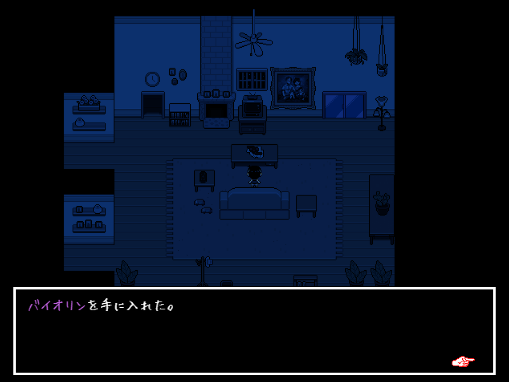

> [!IMPORTANT]
> **このページにはゲーム「OMORI」のネタバレが多少含まれています**

# REVERIEとは

REVERIEはOMORIに新たなストーリーを追加する非公式の大規模なMODです。

トゥルーエンドの引っ越しのあとに、主人公が現実世界の新しい土地と変わってしまったヘッドスペースを冒険する、といった内容になっています。

今回ヘッドスペースでは今までのお友達とは別に「パンキジ」「スイートハート」「スペースボーイ」の3人と一緒に冒険します。

ヘッドスペースは大きく姿を変え、新しいエリアも増えています。

エネミーやボス、アイテム、スキル、音楽なども新しいものが多数追加されています。

現実世界パートでは完全に新しい都会での生活を送ります。

2026年3月1日にチャプター4の日本語版を公開しました。

通しで遊べば12時間ほど遊べるボリュームとなっております。

# 難易度

難易度が選択できるようになっており、「かんたん」「ふつう」「むずかしい」の3種類から選べます。

「かんたん」はチャプター4で新しく追加された難易度です。

「ふつう」はオリジナルのOMORIより少し難しめな難易度となっています。

「むずかしい」でないとエネミーが使わないスキルが一部あるので、すべてのコンテンツを網羅するには「むずかしい」を遊ぶ必要があります。

最初は「ふつう」で遊ぶのをおすすめします。

難易度はいつでも変更が可能です。

# 遊ぶには

このMODで遊ぶには[Steam版のOMORI](https://store.steampowered.com/app/1150690/OMORI/)が必要です。

Switch版やXBox版など他のOMORIでは不可能です。

必要なMODは以下の3つです。

- [OneLoader](https://mods.one/mod/oneloader)  
  すべてのMODを動作させるのに必要なMODローダーです。  
  MinecraftでいうForgeのようなものです。

- [REVERIE](https://mods.one/mod/reverie)  
  今回の追加コンテンツのMODです。

- [CJK Data Compatibility](https://mods.one/mod/cjkdatacompat)  
  英語版ではないOMORIで英語版向けのMODを使えるようにする互換MODです。  
  REVERIE日本語版は英語版を改変して作っているので必要な前提MODです。

MODのインストール方法は[こちら](/posts/2026/02/27/how-to-install-omori-mod/)の記事を参考にしてください。

# REVERIEの世界へようこそ

「はじめる」を選んで、難易度選択画面が出れば正常に導入されています。

うまく行かない場合、Discordの[REVERIE日本語サーバー](https://discord.gg/pSCmKyE8VJ)で質問してみてください。

# ヒント

バニラとセーブデータは共有です。

セーブデータは`www/save`の中に入ってるので、バックアップを取ることを強くおすすめします。

MODの影響で元のセーブデータが壊れる可能性もあります。

MODのタイトルに**チャプター4**という文字が入っていますが、最新版の1つだけでチャプター1から4まですべてのデータが含まれています。

チャプター4のバージョンからセーブスロット追加MODが標準で含まれるようになったため、これらを導入する手間もなくなりました。

# よくある質問

- どのバージョンを使えばいいですか？  
  日本語のバージョンは`+jp`を含んでいます。  
  基本的に最新バージョンを入れれば問題ないはずです。  

- セーブデータは引き継ぎできますか？  
  MODのない元のOMORIとは全く別のセーブデータを作る必要があります。  
  チャプター2.5かそれ以降のセーブデータなら新しいバージョンでも続きから始めることができます。  

- YouTubeやTwitchで配信してもいいですか？  
  全く問題ないです！  
  もし配信してくれるならぜひDiscordサーバーで宣伝してください。見に行きます！

# 最後に

REVERIEはかなりボリュームが大きく、翻訳作業だけでかなりの時間を費やしています。

自分1人だけでほとんど全ての文章を翻訳しているため、漏れやミスがあるかもしれません。

また、口調なども基本的に自分の独断で決めているため、プレイしていて

「俺のスイートハートはこんなセリフ言わない！！」

みたいな解釈違いが起こるかもしれません。

そんなときはDiscordでこっそり教えてくれると嬉しいです。

というわけで、OMORIが好きな人はREVERIEを遊んでみてね！

感想はTwitterでハッシュタグ #omori #reverie をつけて投稿してください！
