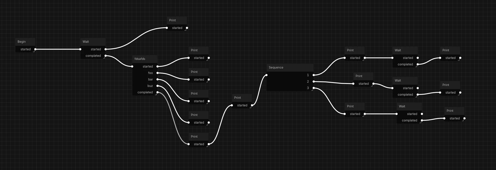

その名も...

# [yasuna.gd](https://github.com/aoisensi/yasuna.gd)

作ってるゲームでシナリオの管理にいいプラグインが見つからないので作ることにした。

今までは[Blockflow](https://github.com/AnidemDex/Blockflow)を使っていたのだけれどもこれだと実現できない機能が必要になってきた。

似たようなプラグインはいくつかあったんだけど、大抵はどれもビジュアルノベルっぽいシステムを作る前提で作られていた。

今回のプラグインの要件はこれ
- グラフエディタを使ってビジュアルスクリプトのようにシナリオを管理できる。
- グラフエディタ上でカスタムコントロールを追加し、プレビューできるようにする。
- 非同期のタスクをサポートし、出力もある程度自由にできるようにする。
- 現在実行中のタスクを任意のタイミングでセーブ、ロードができるようにする。つまりステートフル。

特に最後の要件を満たせそうなのは1つも見つからなかった。

Half-Lifeのようなリアルタイムセーブを導入したいので必要な要件。

今はこれを書き始めて3日目だけど思ったよりいいペースでできている。

最低限の動作ができるところまでできた。

ただ、GodotにSetが無いのがつらい...
